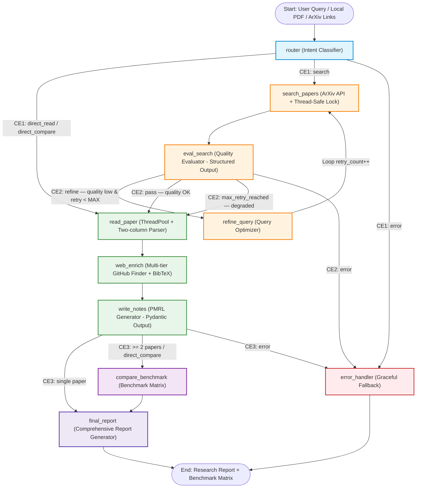

# Kiến Trúc Backend LangGraph — AI Research Paper Scout & Benchmark Assistant

> Tài liệu mô tả kiến trúc hệ thống hiện tại, sơ đồ luồng xử lý, cấu trúc dự án, và giải thích chi tiết từng thành phần mã nguồn.

---

## 1. Sơ Đồ Kiến Trúc Luồng LangGraph



### Tóm tắt luồng xử lý

| Bước | Node                  | Mô tả                                                                                         |
| :----: | :-------------------- | :---------------------------------------------------------------------------------------------- |
|   1   | `router`            | Phân loại intent (search / direct_read / direct_compare) dựa trên rule-based + LLM fallback |
|   2   | `search_papers`     | Gọi ArXiv API với rate-limit thread-safe, trả về danh sách`PaperItem`                    |
|   3   | `eval_search`       | LLM chấm điểm relevance, chọn top-K bài tốt nhất hoặc yêu cầu refine                  |
|   4   | `refine_query`      | LLM tối ưu lại từ khóa tìm kiếm dựa trên feedback → quay lại bước 2                |
|   5   | `read_paper`        | Tải PDF, trích xuất text 2 cột (two-column block parsing), bóc tách sections              |
|   6   | `web_enrich`        | Tìm repo GitHub 3 tầng + tạo BibTeX citation                                                 |
|   7   | `write_notes`       | LLM tổng hợp ghi chú PMRL (Problem-Method-Result-Limitation)                                 |
|   8   | `compare_benchmark` | LLM lập bảng ma trận so sánh từ PMRLNotes (chỉ khi ≥ 2 bài)                             |
|   9   | `final_report`      | LLM tổng hợp báo cáo nghiên cứu chuyên sâu, lưu file Markdown                          |
|   —   | `error_handler`     | Xử lý graceful fallback khi bất kỳ node nào gặp lỗi                                      |

---

## 2. Cấu Trúc Dự Án

```
d:\LABAI\agentresearch\
├── .env                        # API keys & cấu hình runtime
├── config.py                   # AppConfig tập trung (paths, limits, model defaults)
├── state.py                    # Pydantic models & TypedDict ResearchState
├── graph.py                    # StateGraph definition, conditional edges & checkpointer
├── app.py                      # Giao diện Streamlit (4 tabs)
├── main.py                     # CLI entry point
│
├── prompts/                    # Prompt templates tách biệt theo node
│   ├── router_prompt.py
│   ├── eval_search_prompt.py
│   ├── refine_query_prompt.py
│   ├── pmrl_notes_prompt.py
│   ├── benchmark_prompt.py
│   └── final_report_prompt.py
│
├── tools/                      # Công cụ chuyên sâu (không gọi LLM)
│   ├── arxiv_search.py         # Thread-safe ArXiv API (Lock + Exponential Backoff)
│   ├── pdf_parser.py           # Two-column PDF parser + Section extractor
│   ├── github_enricher.py      # Multi-tier GitHub search (3 fallback tiers)
│   ├── bibtex_generator.py     # Sinh BibTeX citation chuẩn
│   ├── cache_manager.py        # Canonical key + JSON/PDF cache
│   └── llm_provider.py         # Factory tạo ChatModel (Gemini/OpenAI/OpenRouter/Anthropic)
│
├── nodes/                      # Từng Node LangGraph — mỗi file 1 hàm
│   ├── router.py
│   ├── search.py
│   ├── eval_search.py
│   ├── refine_query.py
│   ├── read_paper.py
│   ├── web_enrich.py
│   ├── write_notes.py
│   ├── compare_benchmark.py
│   ├── final_report.py
│   └── error_handler.py
│
├── tests/                      # PyTest suite
│   ├── test_tools.py
│   ├── test_nodes.py
│   └── test_graph_flow.py
│
├── data/cache/                 # Cache tự động (pdfs/ + text/)
├── reports/                    # Báo cáo Markdown đã xuất
└── docs/
    └── architecture.md         # ← File này
```

---

## 3. Giải Thích Chi Tiết Code Từng Thành Phần

### 3.1. State — Trạng Thái Toàn Cục (`state.py`)

File này định nghĩa **toàn bộ cấu trúc dữ liệu** chảy qua mọi node trong graph.

#### Pydantic Models (Dữ liệu có cấu trúc & validation tự động)

| Model                | Vai trò                                                                                                                        |
| :------------------- | :------------------------------------------------------------------------------------------------------------------------------ |
| `PMRLNotes`        | Ghi chú theo khung**P**roblem–**M**ethod–**R**esult–**L**imitation, mỗi trường là 1 đoạn văn |
| `GitHubRepoInfo`   | Metadata repo GitHub: tên, URL, stars, framework, cờ official                                                                 |
| `PaperItem`        | Đại diện 1 bài báo xuyên suốt vòng đời: từ kết quả search → tải PDF → trích xuất → PMRL → report            |
| `EvalSearchOutput` | Kết quả đánh giá chất lượng tìm kiếm:`passed`, `score`, `feedback`, `selected_indices`                        |

#### `ResearchState` (TypedDict)

Đây là **global state** của LangGraph — mỗi node nhận state này làm input và trả về `Dict[str, Any]` để merge vào state.

Điểm đặc biệt: 2 trường `trace_logs` và `error_logs` dùng **Annotated Reducer** (`operator.add`) — khi node trả về danh sách log mới, LangGraph **nối thêm** thay vì ghi đè, giúp bảo toàn toàn bộ lịch sử thực thi.

```python
trace_logs: Annotated[List[str], operator.add]   # Append-only
error_logs: Annotated[List[str], operator.add]   # Append-only
```

---

### 3.2. Cấu Hình Tập Trung (`config.py`)

Class `AppConfig` tập trung mọi hằng số cấu hình, đọc từ `.env` qua `dotenv`:

| Nhóm              | Tham số                                                        | Ý nghĩa                                                                   |
| :----------------- | :-------------------------------------------------------------- | :-------------------------------------------------------------------------- |
| **LLM**      | `DEFAULT_PROVIDER`, `DEFAULT_MODEL`                         | Provider/model mặc định (ví dụ:`gemini` / `gemini-3.1-flash-lite`) |
| **API Keys** | `GEMINI_API_KEY`, `OPENAI_API_KEY`, ...                     | Chìa khóa xác thực cho từng provider                                   |
| **ArXiv**    | `ARXIV_MIN_INTERVAL_SEC=3.0`                                  | Khoảng cách tối thiểu giữa 2 request ArXiv (tránh HTTP 429)           |
| **Search**   | `MAX_RETRIES=2`, `MAX_SEARCH_RESULTS=5`, `TOP_K_PAPERS=3` | Giới hạn vòng lặp refine, số kết quả tìm kiếm, số bài chọn      |
| **PDF**      | `PDF_MAX_PAGES=8`, `PDF_MAX_CHARS=15000`                    | Giới hạn trang/ký tự khi parse PDF                                      |
| **Paths**    | `PDF_CACHE_DIR`, `TEXT_CACHE_DIR`, `REPORTS_DIR`          | Thư mục cache và xuất báo cáo                                         |

Constructor `__init__` tự động tạo các thư mục cache nếu chưa tồn tại.

---

### 3.3. Đồ Thị LangGraph (`graph.py`)

File trung tâm gắn kết 10 node thành 1 `StateGraph` hoàn chỉnh.

#### 3 Conditional Edge Functions

```python
def route_after_router(state) -> str:
    # CE1: error → error_handler
    #       direct_read/direct_compare → read_paper (bỏ qua search)
    #       search → search_papers

def route_after_eval_search(state) -> str:
    # CE2: error → error_handler
    #       eval_passed=True → read_paper
    #       retry_count < MAX_RETRIES → refine_query (loop)
    #       hết retry → read_paper (graceful degradation)

def route_after_write_notes(state) -> str:
    # CE3: error → error_handler
    #       ≥ 2 papers hoặc direct_compare → compare_benchmark
    #       1 paper → final_report (bỏ qua so sánh)
```

#### `build_research_graph()`

1. **Tạo `StateGraph(ResearchState)`** — khai báo kiểu state
2. **Thêm 10 node** bằng `workflow.add_node(name, function)`
3. **Nối cạnh**: 4 cạnh cố định + 3 conditional edges (CE1, CE2, CE3) + 1 vòng lặp `refine_query → search_papers`
4. **Compile** với `MemorySaver` checkpointer (lưu snapshot state theo `thread_id`)

Kết quả trả về là 1 `CompiledGraph` object có thể gọi `.stream()` hoặc `.invoke()`.

---

### 3.4. Node: `router` (`nodes/router.py`)

**Chức năng**: Phân loại intent của người dùng thành 1 trong 3 nhánh.

**Chiến lược 2 lớp**:

1. **Rule-Based (Ưu tiên #1)** — Không cần gọi LLM, chạy tức thì:

   - Nếu `raw_inputs` có đúng 1 phần tử → `direct_read`
   - Nếu `raw_inputs` có ≥ 2 phần tử → `direct_compare`
   - Tự động phát hiện ArXiv ID (`\d{4}\.\d{4,5}`) và local PDF path
2. **LLM Classifier (Fallback)** — Cho câu hỏi tự nhiên:

   - Gọi LLM với `with_structured_output(RouterDecision)` → đảm bảo JSON output
   - Prompt yêu cầu trích xuất **từ khóa tiếng Anh học thuật** nếu câu hỏi bằng tiếng Việt
   - Ví dụ: `"Tôi muốn tìm bài báo unlearning"` → `search_query = "machine unlearning in AI"`

**Error handling**: Nếu LLM lỗi (mạng, quota) → fallback tự động về `intent="search"` với `search_query` nguyên bản.

---

### 3.5. Node: `search_papers` (`nodes/search.py`)

**Chức năng**: Gọi hàm `arxiv_search()` từ `tools/arxiv_search.py` và cập nhật `search_results`.

- Nhận `search_query` từ state (đã được router hoặc refine_query chuẩn hóa)
- Trả về danh sách `PaperItem` (title, summary, authors, arxiv_id, pdf_url)
- Nếu API lỗi → set `status="error"` để CE1 chuyển sang `error_handler`

---

### 3.6. Node: `eval_search` (`nodes/eval_search.py`)

**Chức năng**: LLM đánh giá chất lượng kết quả tìm kiếm, chọn top-K bài tốt nhất.

**Cơ chế**:

1. Format danh sách ứng viên (title, abstract, authors) thành chuỗi text
2. Gọi LLM với `with_structured_output(EvalSearchOutput)` → nhận `passed`, `score`, `feedback`, `selected_indices`
3. Dùng `selected_indices` để chọn đúng các `PaperItem` từ `search_results` → ghi vào `selected_papers`
4. Nếu LLM trả `passed=False` → CE2 sẽ route sang `refine_query`

**Fallback**: Nếu LLM lỗi → tự động chấp nhận top-K bài đầu tiên (`eval_passed=True`).

---

### 3.7. Node: `refine_query` (`nodes/refine_query.py`)

**Chức năng**: Tối ưu lại từ khóa tìm kiếm dựa trên feedback từ eval_search.

- LLM nhận `user_query` + `current_search_query` + `eval_feedback` → sinh `search_query` mới
- Tăng `retry_count` mỗi lần refine
- Dùng `extract_text_from_response()` để xử lý an toàn response content (tương thích cả chuỗi `str` lẫn `list` parts)
- CE2 kiểm tra `retry_count < MAX_RETRIES` để quyết định loop tiếp hay dừng

---

### 3.8. Node: `read_paper` (`nodes/read_paper.py`)

**Chức năng**: Tải PDF và trích xuất nội dung theo cấu trúc section — chạy **song song** bằng `ThreadPoolExecutor`.

**Pipeline xử lý mỗi bài báo** (trong `sync_extract_pdf_content`):

1. **Check cache** → nếu đã parse trước đó thì dùng lại ngay
2. **Xác định nguồn PDF**: cache local → local path → tải từ ArXiv
3. **Trích xuất text 2 cột** (`extract_ordered_blocks_from_pdf`):
   - Dùng PyMuPDF (`fitz`) lấy text blocks kèm tọa độ (x0, y0, x1, y1)
   - Chia block theo `mid_x = page.width / 2`: cột trái vs cột phải
   - Sắp xếp: cột trái (trên→dưới) rồi cột phải (trên→dưới) → đúng thứ tự đọc
   - Fallback sang `pypdf` nếu PyMuPDF không cài
4. **Bóc tách section** (`parse_structured_sections`):
   - Regex match: `abstract`, `methodology`, `experiments`, `limitations`
   - Giới hạn: abstract/limitations ≤ 2000 chars, methodology/experiments ≤ 4000 chars
   - Fallback chunking nếu regex không match (chia text thô theo vị trí)
5. **Lưu cache** JSON để lần sau không cần parse lại

**Concurrency**: `ThreadPoolExecutor(max_workers=min(n_papers, 4))` — tối đa 4 paper song song.

---

### 3.9. Node: `web_enrich` (`nodes/web_enrich.py`)

**Chức năng**: Làm giàu mỗi bài báo với mã nguồn GitHub và BibTeX citation.

#### GitHub Multi-tier Search (`tools/github_enricher.py`)

Tìm kiếm repo theo 3 tầng fallback, dừng ngay khi đủ kết quả:

| Tier | Query                                   | Ưu điểm                                                                 |
| :--: | :-------------------------------------- | :------------------------------------------------------------------------- |
|  1  | `"<ArXiv-ID>"`                        | Chính xác nhất — nhiều tác giả ghi ArXiv ID vào description/README |
|  2  | `<6 từ khóa từ title> paper`       | Tìm theo tên paper rút gọn                                             |
|  3  | `<Last name tác giả> <3 từ khóa>` | Tìm theo tên tác giả chính                                            |

Tự động đánh dấu `is_official=True` nếu description chứa "official" hoặc ArXiv ID.

#### BibTeX Generator (`tools/bibtex_generator.py`)

Tạo citation key theo format `{LastName}{Year}{FirstWord}` (ví dụ: `vaswani2017attention`), xuất format `@article{...}` chuẩn.

---

### 3.10. Node: `write_notes` (`nodes/write_notes.py`)

**Chức năng**: LLM tổng hợp ghi chú PMRL từ nội dung section đã trích xuất.

**Cơ chế**:

1. Ghép nội dung 4 section (abstract, methodology, experiments, limitations) thành prompt context
2. Gọi LLM với `with_structured_output(PMRLNotes)` → đảm bảo output đúng schema Pydantic
3. Giới hạn context ≤ 14,000 ký tự để tránh vượt token window

**Fallback PMRL**: Nếu LLM lỗi → tạo PMRLNotes mặc định từ summary/text thô.

**Ý nghĩa kiến trúc**: Sau bước này, toàn bộ nội dung bài báo (hàng chục ngàn ký tự `extracted_text`) đã được **nén** thành ~500 từ PMRLNotes có cấu trúc. Các node phía sau (`compare_benchmark`, `final_report`) chỉ đọc `notes` — giảm ~70% token prompt.

---

### 3.11. Node: `compare_benchmark` (`nodes/compare_benchmark.py`)

**Chức năng**: Lập **Ma Trận So Sánh Benchmark** giữa các bài báo (chỉ chạy khi ≥ 2 bài).

**Tối ưu token**: Chỉ đọc từ `PMRLNotes` + `github_repos` — không nạp lại `extracted_text`:

```python
summary_block = (
    f"### Paper {idx}: {p.title}\n"
    f"- Method: {notes.method}\n"      # Từ PMRLNotes, ~150 từ
    f"- Results: {notes.result}\n"     # Từ PMRLNotes, ~150 từ
    f"- Limitations: {notes.limitation}\n"
    f"- GitHub: {github_url}"
)
```

LLM sinh Markdown table với các chiều so sánh: Architecture, Compute, Datasets, Metrics, Pros, Cons, Open Source.

---

### 3.12. Node: `final_report` (`nodes/final_report.py`)

**Chức năng**: Tổng hợp mọi thông tin thành **báo cáo nghiên cứu chuyên sâu** dạng Markdown.

**Cấu trúc báo cáo**: Executive Summary → Paper Breakdowns (PMRL) → Benchmark Matrix → Takeaways → Bibliography.

**Đặc điểm**:

- Gộp PMRL notes + GitHub info + BibTeX + benchmark matrix vào 1 prompt duy nhất
- Lưu file Markdown tự động vào `reports/report_{title}_{timestamp}.md`
- Dùng `extract_text_from_response()` để xử lý an toàn response từ mọi LLM provider

---

### 3.13. Node: `error_handler` (`nodes/error_handler.py`)

**Chức năng**: Bắt mọi trạng thái lỗi (`status="error"`) và tạo báo cáo fallback thay vì crash.

Báo cáo fallback chứa: lý do lỗi, query gốc, intent, số lần retry — giúp người dùng tự debug.

---

### 3.14. Tools Layer

#### `tools/arxiv_search.py` — Thread-safe ArXiv API

| Thành phần             | Chi tiết                                                                                    |
| :----------------------- | :------------------------------------------------------------------------------------------- |
| `_ARXIV_LOCK`          | `threading.Lock()` — serialize mọi request ArXiv giữa các thread                       |
| `_rate_limit_arxiv()`  | Đảm bảo ≥ 3s giữa 2 request, thêm jitter ngẫu nhiên (0.1–0.4s)                      |
| `_arxiv_get()`         | Retry tối đa 3 lần với**Exponential Backoff** (3s → 6s → 12s+) khi gặp HTTP 429 |
| `_clean_arxiv_query()` | Loại bỏ stopwords tiếng Anh + tiếng Việt, format`all:term1 AND all:term2`             |
| `STOPWORDS`            | Bao gồm cả`"toi", "muon", "tim", "bai", "bao", "trong"` — hỗ trợ query tiếng Việt   |

#### `tools/pdf_parser.py` — Two-column Parser

- **`extract_ordered_blocks_from_pdf()`**: Dùng PyMuPDF `page.get_text("blocks")` → chia cột trái/phải theo `mid_x` → sắp xếp theo reading order
- **`parse_structured_sections()`**: Regex bóc tách 4 section chính, fallback cắt text thô nếu regex không match
- **`sync_extract_pdf_content()`**: Orchestrator: cache check → download → parse → save cache

#### `tools/cache_manager.py` — Hệ Thống Cache

| Hàm                         | Chức năng                                                                          |
| :--------------------------- | :----------------------------------------------------------------------------------- |
| `canonicalize_paper_key()` | Sinh key chuẩn:`arxiv_1706.03762` / `local_filename_a1b2c3` / `id_query_hash` |
| `get_cached_pdf_path()`    | Kiểm tra PDF đã tải chưa                                                        |
| `get_cached_text_data()`   | Đọc JSON cache (sections + extracted_text)                                         |
| `save_cached_text_data()`  | Lưu kết quả parse vào JSON cache                                                 |

#### `tools/llm_provider.py` — LLM Factory

| Hàm                             | Chức năng                                                                                                       |
| :------------------------------- | :---------------------------------------------------------------------------------------------------------------- |
| `get_llm()`                    | Factory tạo`BaseChatModel` theo provider: Gemini, OpenAI, OpenRouter, Anthropic                                |
| `extract_text_from_response()` | Xử lý an toàn`response.content` — tương thích cả `str` lẫn `list[ContentPart]` từ Gemini SDK mới |

---

### 3.15. Prompts Layer (`prompts/`)

Mỗi file chứa **đúng 1 biến string** — prompt template dành cho 1 node LLM:

| File                       | Biến                       | Dùng cho Node                                                |
| :------------------------- | :-------------------------- | :------------------------------------------------------------ |
| `router_prompt.py`       | `ROUTER_SYSTEM_PROMPT`    | `router` — phân loại intent, trích từ khóa tiếng Anh |
| `eval_search_prompt.py`  | `EVAL_SEARCH_PROMPT`      | `eval_search` — chấm điểm & chọn bài                  |
| `refine_query_prompt.py` | `REFINE_QUERY_PROMPT`     | `refine_query` — tối ưu từ khóa                        |
| `pmrl_notes_prompt.py`   | `PMRL_NOTES_PROMPT`       | `write_notes` — tổng hợp PMRL                            |
| `benchmark_prompt.py`    | `BENCHMARK_MATRIX_PROMPT` | `compare_benchmark` — lập bảng so sánh                  |
| `final_report_prompt.py` | `FINAL_REPORT_PROMPT`     | `final_report` — sinh báo cáo hoàn chỉnh               |

---

### 3.16. Entry Points

#### `main.py` — CLI

```bash
# Tìm kiếm theo chủ đề
python main.py --query "Diffusion Models in Medical Imaging"

# So sánh 2 bài báo cụ thể
python main.py --inputs "1706.03762" "2005.14165"

# Override model
python main.py --query "machine unlearning" --provider gemini --model gemini-3.6-flash
```

Chạy `graph.stream()` đồng bộ, in trace log từng bước, xuất final report ra terminal.

#### `app.py` — Streamlit Web UI

Giao diện 4 tabs:

| Tab                       | Nội dung                                         |
| :------------------------ | :------------------------------------------------ |
| 📄 Báo Cáo Tổng Hợp   | Markdown report + nút Download                   |
| 📊 Ma Trận So Sánh      | Benchmark table (khi ≥ 2 bài)                   |
| 📝 Ghi Chú PMRL & GitHub | Card từng bài: PMRL notes, GitHub repos, BibTeX |
| ⏱️ Nhật Ký Thực Thi  | Trace logs real-time từng node                   |

Sidebar cho phép chọn LLM provider/model, override API keys, xem sơ đồ luồng xử lý.

---

### 3.17. Tests (`tests/`)

| File                   | Số tests | Phạm vi                                                                       |
| :--------------------- | :-------: | :----------------------------------------------------------------------------- |
| `test_tools.py`      |     3     | `canonicalize_paper_key`, `generate_bibtex`, `parse_structured_sections` |
| `test_nodes.py`      |     3     | `router_node` (1 link, multi links), `error_handler_node`                  |
| `test_graph_flow.py` |     2     | Graph compilation, routing logic (CE1/CE2/CE3)                                 |

Chạy: `python -m pytest tests/ -v` (8/8 PASSED).
